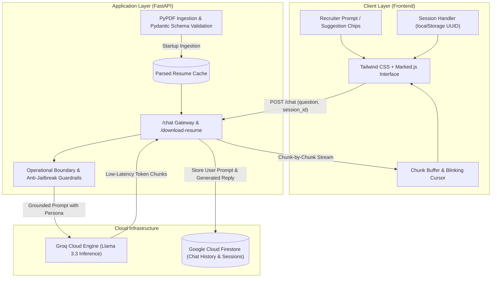

# 🤖 Autonomous AI Portfolio Assistant

An interactive, recruiter-facing AI portfolio agent that represents **Divyansh Verma** in real-time technical interviews. Built with **FastAPI**, **Groq Cloud Inference**, and **Google Cloud Firestore**, this application is strictly grounded in candidate data, resistant to prompt injections, and wrapped in a responsive, ChatGPT-grade interface.

---

> 🚀 **Live Production Application:** [https://ai-powered-portfolio-agent.vercel.app/]

> **Note on Free Tier Latency**: The backend is hosted on Render's free tier, which enters sleep mode after 15 minutes of idle time. The very first request may experience a ~40-second cold-start delay before returning to real-time token streaming.

## 🏗️ System Architecture



---

## ✨ Core Features

*   **Strict Grounding & Zero Hallucination:** Enforces boundary conditions via a multi-rule system prompt. The model refuses off-topic queries in-character and clarifies unlisted project aspects honestly.
*   **Token-by-Token Streaming UX:** Real-time response rendering with custom blinking cursor feedback, auto-expanding textarea, and dynamic auto-scrolling with user scroll detection.
*   **Stream Interruptibility:** Switchable send/stop button allowing recruiters to abort generation mid-sentence via `ReadableStream.cancel()`.
*   **Persistent Session Logging:** Integrates Google Cloud Firestore to log recruiter questions, AI responses, and session timestamps for analytics.
*   **Adaptive Light & Dark Mode:** Persistent theme toggle supporting local storage and tailored color hierarchies.
*   **Recruiter Action Bar:** Integrated CTAs for direct resume PDF downloads (`/download-resume`), profile links (GitHub, LinkedIn, Email), and interview scheduling.
*   **Dynamic Follow-Up Chips:** Keyword-driven dynamic prompt suggestions generated at the end of each answer.

---

## 🛠️ Tech Stack

| Domain | Technologies Used |
| :--- | :--- |
| **Backend** | Python 3.12, FastAPI, Uvicorn, Pydantic, PyPDF |
| **LLM Inference** | Groq Cloud SDK (`llama-3.3-70b-versatile` / `openai/gpt-oss-120b`) |
| **Database** | Google Cloud Firestore (Firebase Admin SDK) |
| **Frontend** | Vanilla JavaScript (ES6+), Tailwind CSS CDN, Marked.js, Lucide Icons |
| **Dependency Manager** | `uv` / Standard `pip` |

---

## 📁 Repository Structure

```text
AI_POWERED_PORTFOLIO_CHATBOT/
├── backend/
│   ├── main.py                     # FastAPI application, Groq logic & Firestore integration
│   ├── RESUME_1 (1).pdf            # Master source-of-truth candidate resume
│   └── serviceAccountKey.json      # Firebase Service Account (gitignored)
├── frontend/
│   └── index.html                  # Responsive SPA with chat feed, drawer, & theme toggle
├── .gitignore                      # Environment variables and key exclusions
├── pyproject.toml                  # Project metadata and UV configuration
├── requirements.txt                # Pinned production dependencies
└── README.md                       # Project documentation
```

---

## 🚀 Local Setup & Installation

### 1. Clone the Repository
```bash
git clone https://github.com/<your-username>/ai-portfolio-assistant.git
cd ai-portfolio-assistant
```

### 2. Set Up Virtual Environment
```bash
# Using uv (Recommended)
uv venv
source .venv/bin/activate  # On Windows use: .venv\Scripts\activate

# Install dependencies
uv pip install -r requirements.txt
```

### 3. Configure Environment & Credentials
Create a `.env` file in the root directory:
```env
GROQ_API_KEY=your_groq_api_key_here
```

Place your Firebase admin credentials JSON file inside the `backend/` directory:
```text
backend/serviceAccountKey.json
```

### 4. Run the Application
Start the backend server:
```bash
uvicorn backend.main:app --reload --port 8000
```
Open `frontend/index.html` in your browser or run it with VS Code Live Server at `http://127.0.0.1:5500`.

---

## 🛡️ License

Distributed under the MIT License. See `LICENSE` for more information.
